# Nivel 2. Introducción a Azure

 

---
# Práctica 1. Realización de una página web con Wordpress

#### Por [Emiliano Rodríguez Pérez](https://github.com/Emiliano-RP) #IA Wizards
#### Sherpa: [José Jesús Guzmán Eusebio](https://github.com/josejesusguzman)
---
#### Requisitos:
- Tener un equipo de cómputo con Windows, Linux o MacOs.
- Tener una cuenta de Microsoft Azure.
- Tener conexión a internet.
---
#### Instrucciones:
1. Nos dirigimos al **[portal de Microsoft Azure](https://portal.azure.com/#home)** para iniciar sesión con el correo de **Innovacción Virtual**.
2. Una vez iniciada la sesión, en la página de inicio nos dirigimos a la **"Barra de búsqueda de recursos, servicios y documentos"**. 

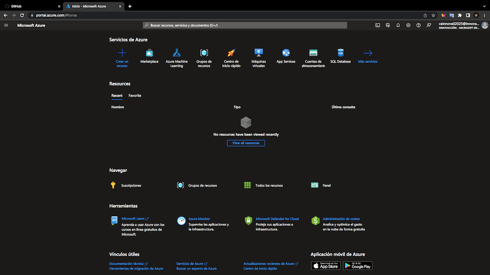

3. Buscamos la palabra **"Marketplace"** y damos click en ella.

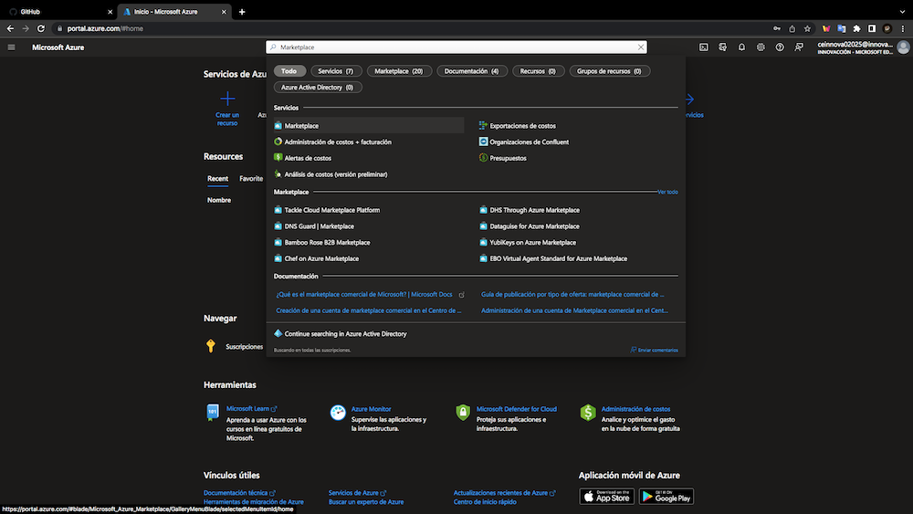

4. Dentro de ese apartado nos dirigimos a la barra de búsqueda **"Buscar en Marketplace"** y bucamos la palabra **WordPress**.

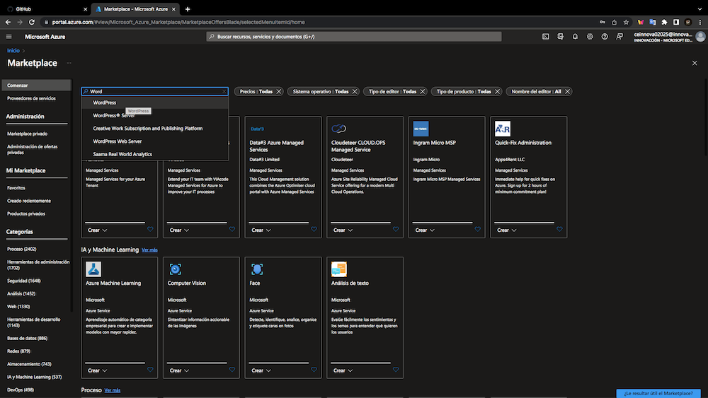

5. Damos click en primer recuadro que dice **"WordPress App Service"**.

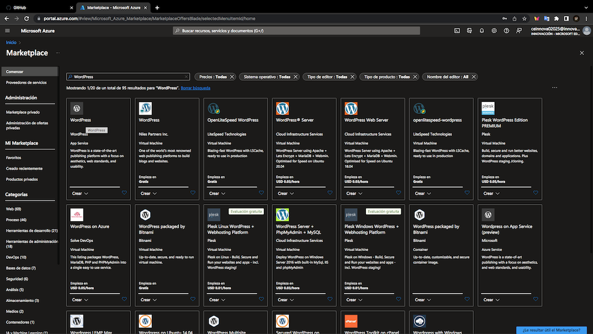

6. Posteriormente damos click en el botón de **"Crear"**.

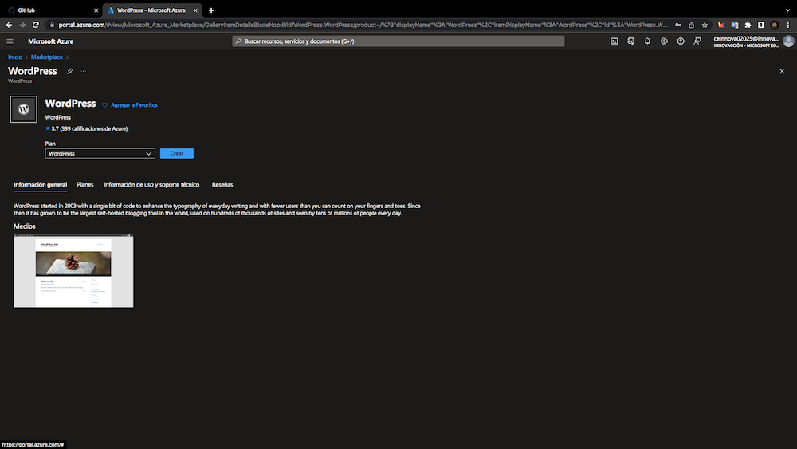

7. Estando en el apartado **"Creación de Wordpress en App Service"**, en **datos básicos** colocamos la información pertinente para crear el recurso **(suscripción, grupo de recursos, región, nombre y sistema operativo, ya sea Windows o Linux)**.

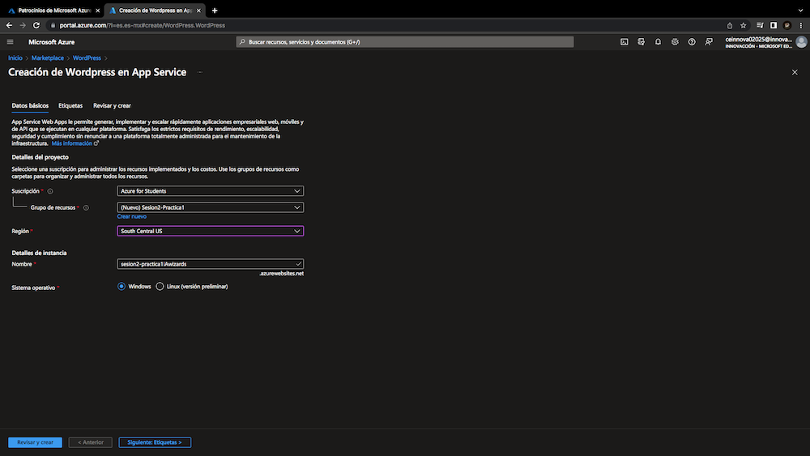

8. Este paso es opcional, pero si es deseable por el usuario se pueden agregar **etiquetas** que nos ayudarán a brindar más información sobre el recurso creado, como *costos, área del departamento empresarial*, entre otros datos.

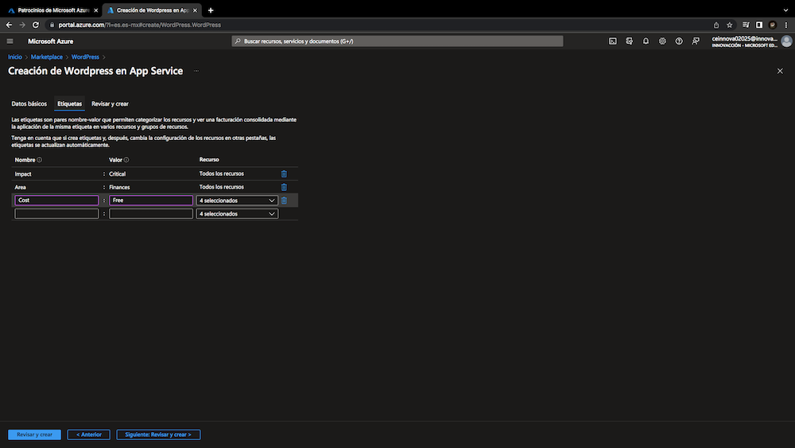

9. Damos click en el botón **"Revisar y crear"** para verificar que la información del recurso sea la correcta. Si todo está correcto, damos click en el botón **"Crear"**.

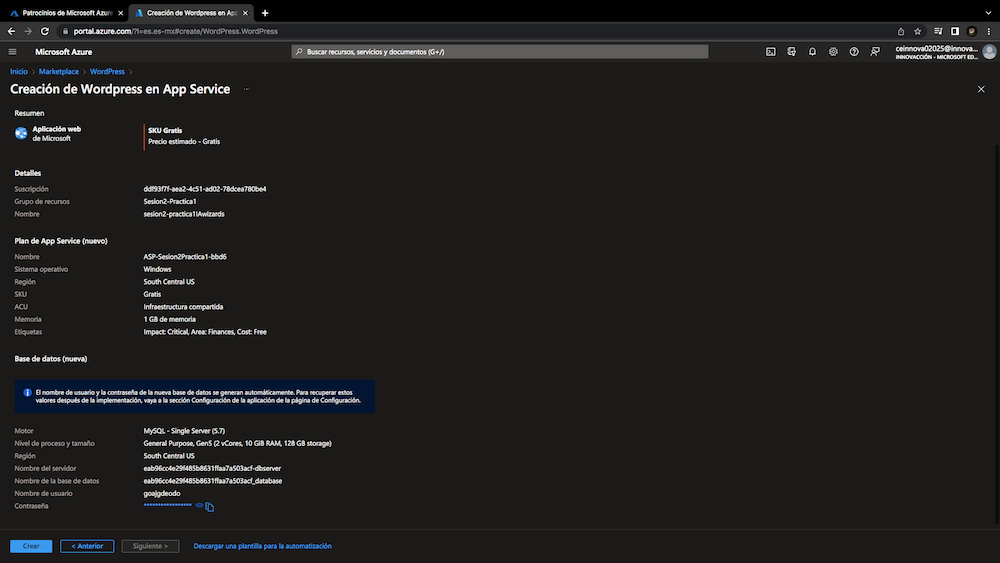

10.  Una vez implementado el recurso correctamente (cabe mencionar que este proceso puede ser tardado), damos click en el botón de **"Ir al recurso"**.

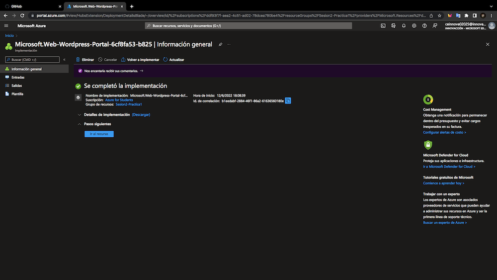

11. A continuación observaremos toda la información del recurso creado y es de nuestro interés dar click en la **URL del recurso**, en este ejemplo podemos observar que la URL es la que se enmarca en el recuadro rojo.

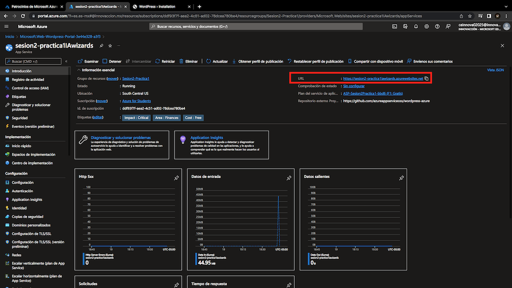

12. Una vez dado click en la URL, nos redireccionará a la página de **WordPress > Instalation** donde configuraremos el idioma.

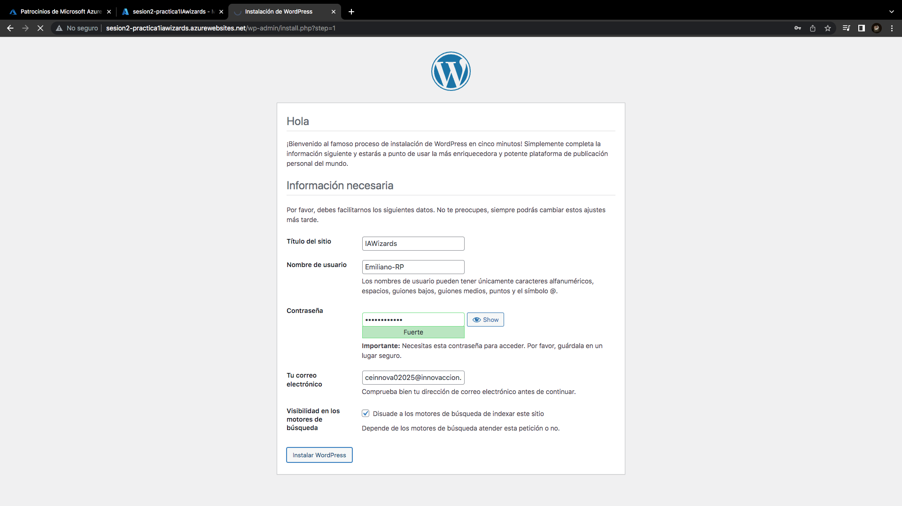

13. Posteriomente proporcionaremos los siguientes datos: **título del sitio, nombre de ususario, contraseña, correo electrónico, y conceder el permiso de visibilidad en los motores de búsqueda**

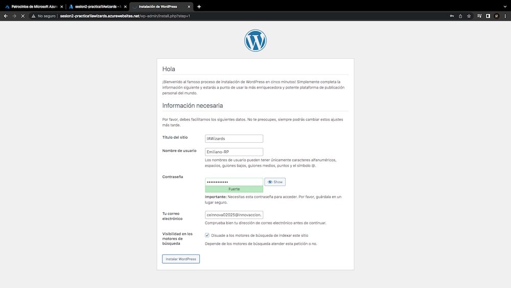

14. Ya instalado WordPress, no aparecerá una página de confirmación, donde daremos click en el botón de **"Acceder"** y por pimera vez podemos visualizar nuestro sitio web.

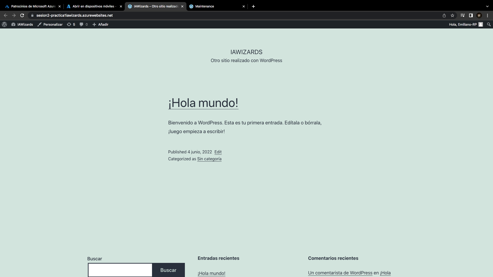
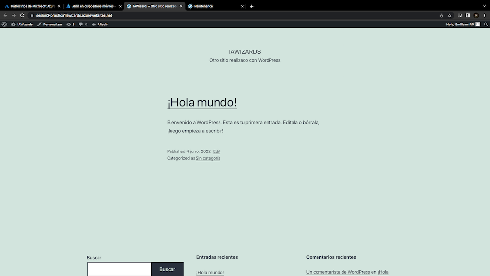

15. Para acceder al panel de administración de la página web, nos dirigimos a la barra de navegación y agregamos el texto: `wp-admin`

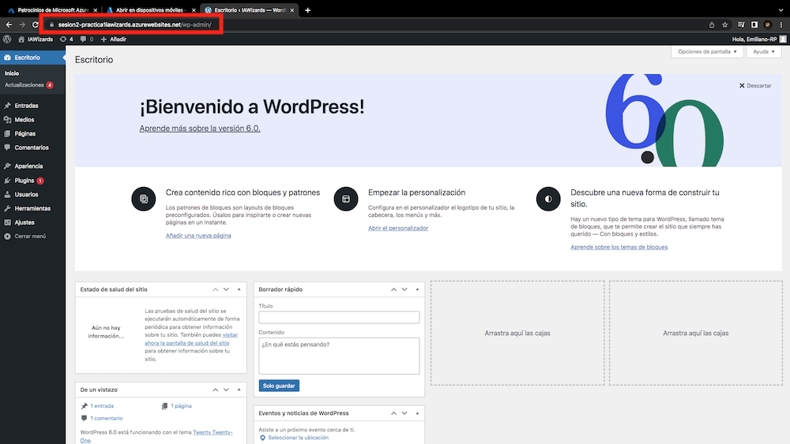

16. En el panel de administrador, podemos modificar el diseño de la página we, eso ya depende de tus gustos y necesidades.

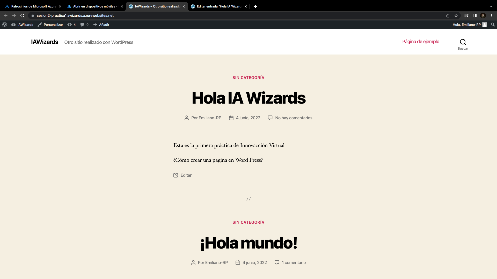

17. Para finalizar esta práctica, nos regresamos al inicio del **[portal de Microsoft Azure](https://portal.azure.com/#home)** en el inicio. Nos dirigfimos al recurso de **App service** y lo detenemos. Una vez detenído, la página web ya no estará disponible.

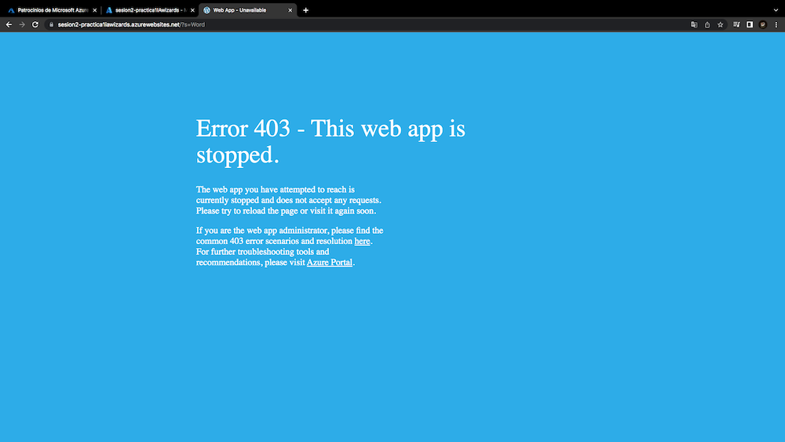

# Fin.
---
#### Por [Emiliano Rodríguez Pérez](https://github.com/Emiliano-RP) #IA Wizards
- ##### Instagram: [@_emiliano_rp](https://www.instagram.com/_emiliano_rp/)
- ##### Facebook: [Emiliano Rodríguez Pérez](https://www.facebook.com/emiliano.rodriguezperez.94/)

---

